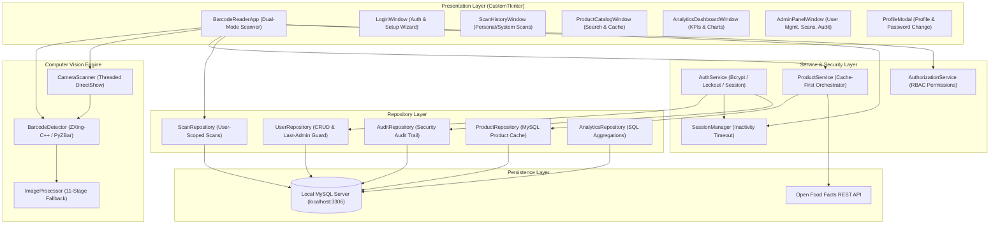

# 📦 Barcode Reader — Enterprise Desktop Barcode Intelligence Platform

[](https://python.org)
[](https://microsoft.com/windows)
[](https://mysql.com)
[](tests/)
[](dist/)
[](LICENSE)

An enterprise-grade desktop computer vision application built with **Python**, **OpenCV**, **ZXing-C++**, **CustomTkinter**, and **MySQL**. 

**Barcode Reader** integrates real-time webcam scanning, multi-barcode detection, an 11-stage image preprocessing pipeline, external product catalog intelligence with local caching, user-scoped scan history, interactive analytics dashboards, and role-based access control (RBAC) with security audit trails.

---

## 🎯 Key Capabilities & Highlights

* **Dual-Mode Barcode Scanner**:
  * **🖼️ Image Scanning Mode**: Drag-and-drop or upload images (`PNG`, `JPG`, `BMP`, `WEBP`, `TIFF`) with automatic downscaling for large resolutions ($>2500\text{px}$) and quality metric estimation (contrast, sharpness, brightness).
  * **📷 Live Webcam Scanning Mode**: Real-time video scanning ($30\text{ FPS}$) with interactive HUD reticle guide, DirectShow hardware acceleration, consecutive-frame stability verification ($N=3$), duplicate cooldown ($2.0\text{s}$), and snapshot capture.
* **Computer Vision & Multi-Barcode Decoding Engine**:
  * Decodes **EAN-13, EAN-8, UPC-A, UPC-E, Code 128, Code 39, Code 93, ITF, QR Code, Data Matrix, Aztec, PDF417, Codabar**.
  * **11-Stage Fallback Preprocessing**: Evaluates raw image, Grayscale, Otsu thresholding, Adaptive Gaussian, CLAHE, Sharpening, Morphological Gradients, Bilateral Filtering, Super-Resolution 2x Upscaling, and 90°/180°/270° rotations.
  * **Multi-Barcode Detection**: Detects and isolates multiple codes in a single image with IoU-based deduplication and exact coordinate inverse transformations.
  * **Checksum Validation**: Real-time Modulo 10 and symbology checksum validation.
* **Product Intelligence & Cache-First Architecture**:
  * Instant product lookup via the **Open Food Facts API** (Product Name, Brand, Category, Ingredients, Allergens, Quantity, Image URL).
  * **Local MySQL Product Cache**: Seamless offline product availability and near-zero latency ($< 3\text{ ms}$) cache hits.
* **Multi-User Security & Role-Based Access Control (RBAC)**:
  * **Bcrypt Password Hashing**: $12$ rounds of salted hashing with constant-time verification.
  * **Brute-Force Lockout Protection**: Automatically locks accounts after 5 failed login attempts (`LOGIN_LOCKOUT_MINUTES=5`).
  * **Inactivity Session Expiration**: Configurable inactivity timeout (`SESSION_TIMEOUT_MINUTES=30`) that releases camera hardware upon expiration.
  * **Strict Data Isolation**: Normal users access only their own scan history (`WHERE user_id = current_user.id`), while administrators inspect system-wide data.
  * **🛡️ Last-Admin Protection**: Guarantees the system never deactivates or demotes the last remaining active administrator account.
* **Administrator Control Panel & Audit Trail**:
  * User management (Activate / Deactivate accounts, Promote / Demote roles).
  * Chronological security audit logs tracking logins, logouts, role changes, and deletions.
  * System-wide scan record inspection and deletion.
* **Analytics Dashboard & Data Export**:
  * Real-time KPIs (Total Scans, Unique Codes, Cached Products, Today's Scans, API Lookup Success Rate).
  * Visual distribution bar charts and daily scan activity trends.
  * Filtered export to **CSV** and **JSON** with ownership security.

---

## 🏛️ System Architecture



---

## 🔐 Access Control Matrix

| Feature / Capability | `USER` | `ADMIN` | Enforcing Layer |
|:---|:---:|:---:|:---|
| Login & Account Registration | ✓ | ✓ | `AuthService` |
| Image & Live Camera Scanning | ✓ | ✓ | `BarcodeReaderApp` |
| Save Barcode Scans | ✓ (`user_id` attached) | ✓ (`user_id` attached) | `ScanRepository` (SQL) |
| View Own Scan History | ✓ | ✓ | `ScanRepository` (SQL) |
| View All Users' Scan History | ✗ | ✓ | `AuthorizationService` |
| Delete Own Scan Records | ✓ | ✓ | `ScanRepository` (SQL) |
| Delete Any Scan Record | ✗ | ✓ | `AuthorizationService` |
| Export Own Scan Records (CSV/JSON) | ✓ | ✓ | `ScanRepository` |
| Export All System Scan Records | ✗ | ✓ | `AuthorizationService` |
| Product Intelligence & Lookup | ✓ | ✓ | `ProductService` |
| View Shared Product Cache | ✓ | ✓ | `ProductRepository` |
| Delete Cached Product | ✗ | ✓ | `AuthorizationService` |
| Personal Analytics Dashboard | ✓ | ✓ | `AnalyticsRepository` (SQL) |
| System-Wide Analytics Dashboard | ✗ | ✓ | `AuthorizationService` |
| User Management & Search | ✗ | ✓ | `AdminPanelWindow` |
| Activate / Deactivate Accounts | ✗ | ✓ | `UserRepository` (Last-Admin Guard) |
| Role Promotion / Demotion | ✗ | ✓ | `UserRepository` (Last-Admin Guard) |
| Security Audit Trail Inspection | ✗ | ✓ | `AuditRepository` |
| Change Own Password | ✓ | ✓ | `AuthService` |
| Access Administrator Panel | ✗ | ✓ | `AuthorizationService` |

---

## 🗄️ Database Schemas & Data Model

```sql
-- 1. Users Table
CREATE TABLE IF NOT EXISTS `users` (
    `id` BIGINT AUTO_INCREMENT PRIMARY KEY,
    `username` VARCHAR(100) NOT NULL UNIQUE,
    `email` VARCHAR(255) NOT NULL UNIQUE,
    `password_hash` VARCHAR(255) NOT NULL,
    `role` VARCHAR(20) NOT NULL DEFAULT 'USER',
    `is_active` BOOLEAN NOT NULL DEFAULT TRUE,
    `created_at` DATETIME NOT NULL DEFAULT CURRENT_TIMESTAMP,
    `updated_at` DATETIME NOT NULL DEFAULT CURRENT_TIMESTAMP ON UPDATE CURRENT_TIMESTAMP,
    `last_login` DATETIME NULL,
    INDEX `idx_user_username` (`username`),
    INDEX `idx_user_email` (`email`),
    INDEX `idx_user_role` (`role`)
) ENGINE=InnoDB DEFAULT CHARSET=utf8mb4 COLLATE=utf8mb4_unicode_ci;

-- 2. Barcode Scans Table (with user_id scoping)
CREATE TABLE IF NOT EXISTS `barcode_scans` (
    `id` BIGINT AUTO_INCREMENT PRIMARY KEY,
    `barcode_type` VARCHAR(50) NOT NULL,
    `barcode_data` TEXT NOT NULL,
    `image_name` VARCHAR(255),
    `scan_date` DATETIME NOT NULL DEFAULT CURRENT_TIMESTAMP,
    `validation_status` VARCHAR(30) DEFAULT 'Not Available',
    `x_position` INT DEFAULT 0,
    `y_position` INT DEFAULT 0,
    `width` INT DEFAULT 0,
    `height` INT DEFAULT 0,
    `processing_method` VARCHAR(100) DEFAULT 'Original Image',
    `processing_time_ms` DOUBLE DEFAULT 0.0,
    `source` VARCHAR(20) DEFAULT 'image',
    `user_id` BIGINT NULL,
    INDEX `idx_barcode_type` (`barcode_type`),
    INDEX `idx_scan_date` (`scan_date`),
    INDEX `idx_user_id` (`user_id`),
    CONSTRAINT `fk_scans_user` FOREIGN KEY (`user_id`) 
        REFERENCES `users` (`id`) ON DELETE SET NULL
) ENGINE=InnoDB DEFAULT CHARSET=utf8mb4 COLLATE=utf8mb4_unicode_ci;

-- 3. Products Table (Shared Cache)
CREATE TABLE IF NOT EXISTS `products` (
    `id` BIGINT AUTO_INCREMENT PRIMARY KEY,
    `barcode` VARCHAR(100) NOT NULL UNIQUE,
    `name` VARCHAR(255),
    `brand` VARCHAR(255),
    `category` VARCHAR(255),
    `description` TEXT,
    `image_url` TEXT,
    `quantity` VARCHAR(100),
    `ingredients` TEXT,
    `allergens` TEXT,
    `source` VARCHAR(100) DEFAULT 'Product API',
    `created_at` DATETIME NOT NULL DEFAULT CURRENT_TIMESTAMP,
    `updated_at` DATETIME NOT NULL DEFAULT CURRENT_TIMESTAMP ON UPDATE CURRENT_TIMESTAMP,
    INDEX `idx_product_barcode` (`barcode`),
    INDEX `idx_product_name` (`name`),
    INDEX `idx_product_brand` (`brand`)
) ENGINE=InnoDB DEFAULT CHARSET=utf8mb4 COLLATE=utf8mb4_unicode_ci;

-- 4. Audit Logs Table (Security Trail)
CREATE TABLE IF NOT EXISTS `audit_logs` (
    `id` BIGINT AUTO_INCREMENT PRIMARY KEY,
    `user_id` BIGINT NULL,
    `username` VARCHAR(100) NULL,
    `action` VARCHAR(100) NOT NULL,
    `target_type` VARCHAR(50) NULL,
    `target_id` VARCHAR(100) NULL,
    `description` TEXT,
    `created_at` DATETIME NOT NULL DEFAULT CURRENT_TIMESTAMP,
    INDEX `idx_audit_action` (`action`),
    INDEX `idx_audit_user_id` (`user_id`),
    INDEX `idx_audit_created_at` (`created_at`)
) ENGINE=InnoDB DEFAULT CHARSET=utf8mb4 COLLATE=utf8mb4_unicode_ci;
```

---

## ⚡ Quick Start & Setup Guide

### 1. Prerequisites
* **Windows 10 / 11** (64-bit)
* **Python 3.11+** (Tested on Python 3.14)
* **MySQL Server 8.0+** running locally on port `3306`

### 2. Installation
```powershell
# Clone the repository
git clone https://github.com/yourusername/barcode-reader.git
cd "barcode-reader"

# Create and activate virtual environment
python -m venv .venv
.\.venv\Scripts\Activate.ps1

# Install dependencies
pip install -r requirements.txt

# Configure environment credentials
copy .env.example .env
```

### 3. Configure `.env`
Edit `.env` to match your local MySQL configuration:
```ini
# Local MySQL Database Configuration
DB_HOST=localhost
DB_PORT=3306
DB_NAME=barcode_reader
DB_USER=root
DB_PASSWORD=your_actual_mysql_password

# Authentication & Session Security
SESSION_TIMEOUT_MINUTES=30
MAX_LOGIN_ATTEMPTS=5
LOGIN_LOCKOUT_MINUTES=5

# External Product API Settings
PRODUCT_API_BASE_URL=https://world.openfoodfacts.org/api/v2/product/
PRODUCT_API_TIMEOUT=5
```

### 4. Initialize Database
```powershell
python setup_database.py
```

### 5. Launch Application
```powershell
python app.py
```

---

## 🧪 Comprehensive Automated Testing

The project contains **79 automated unit and integration tests** with 100% pass rate:

```powershell
python -m pytest tests/ -v
```

### Test Suite Modules:
* [`tests/test_security.py`](file:///C:/Users/MSI%20PC/OneDrive/Desktop/Developement/Barcode%20Reader/tests/test_security.py): Bcrypt password hashing, verification, input validation, login rate limiting and lockout.
* [`tests/test_auth.py`](file:///C:/Users/MSI%20PC/OneDrive/Desktop/Developement/Barcode%20Reader/tests/test_auth.py): User registration, login by username or email, password change, account deactivation.
* [`tests/test_users.py`](file:///C:/Users/MSI%20PC/OneDrive/Desktop/Developement/Barcode%20Reader/tests/test_users.py): User repository CRUD, role promotion/demotion, Last-Admin protection guard.
* [`tests/test_sessions.py`](file:///C:/Users/MSI%20PC/OneDrive/Desktop/Developement/Barcode%20Reader/tests/test_sessions.py): Session tracking, inactivity timeout (30m), `touch()` activity extension, session cleanup.
* [`tests/test_authorization.py`](file:///C:/Users/MSI%20PC/OneDrive/Desktop/Developement/Barcode%20Reader/tests/test_authorization.py): RBAC permission matrix checks for `USER` and `ADMIN`.
* [`tests/test_data_isolation.py`](file:///C:/Users/MSI%20PC/OneDrive/Desktop/Developement/Barcode%20Reader/tests/test_data_isolation.py): Multi-user scan isolation, cross-user delete prevention, admin access.
* [`tests/test_audit.py`](file:///C:/Users/MSI%20PC/OneDrive/Desktop/Developement/Barcode%20Reader/tests/test_audit.py): Audit logging, SQL parameterization, pagination.
* [`tests/test_barcode_detector.py`](file:///C:/Users/MSI%20PC/OneDrive/Desktop/Developement/Barcode%20Reader/tests/test_barcode_detector.py): Multi-barcode detection, rotations, low contrast, Modulo 10 checksums.
* [`tests/test_image_processor.py`](file:///C:/Users/MSI%20PC/OneDrive/Desktop/Developement/Barcode%20Reader/tests/test_image_processor.py): Quality metrics, coordinate inverse transformations, preview scaling, bounding boxes.
* [`tests/test_camera_scanner.py`](file:///C:/Users/MSI%20PC/OneDrive/Desktop/Developement/Barcode%20Reader/tests/test_camera_scanner.py) & [`tests/test_scan_stability.py`](file:///C:/Users/MSI%20PC/OneDrive/Desktop/Developement/Barcode%20Reader/tests/test_scan_stability.py): Live DirectShow camera capture, stability ($N=3$), duplicate cooldown.
* [`tests/test_product_service.py`](file:///C:/Users/MSI%20PC/OneDrive/Desktop/Developement/Barcode%20Reader/tests/test_product_service.py) & [`tests/test_product_repository.py`](file:///C:/Users/MSI%20PC/OneDrive/Desktop/Developement/Barcode%20Reader/tests/test_product_repository.py): Cache-first product lookup, API fallback, MySQL upsert.
* [`tests/test_analytics_repository.py`](file:///C:/Users/MSI%20PC/OneDrive/Desktop/Developement/Barcode%20Reader/tests/test_analytics_repository.py): SQL aggregations, format distribution, daily counts, top barcodes.

---

## 📦 Standalone Windows Distribution (PyInstaller)

To build the standalone Windows executable:
```powershell
python -m PyInstaller --onedir --windowed --name=BarcodeReader --icon=assets/barcode_reader.ico --collect-all customtkinter --add-data="assets;assets" app.py --noconfirm
```

The resulting distributable package is located in `dist/BarcodeReader/BarcodeReader.exe`.

---

## 🎓 B.Tech Project Viva & Demonstration Guide

During project presentation and viva examination, follow this 12-step live demonstration workflow:

1. **First-Time Administrator Setup**: Launch `app.py`. Show the automatic First-Admin wizard on clean database initialization.
2. **User Registration & Login**: Register a standard `USER` account (`alice`) and log in. Show the masked input and lockout protection.
3. **Image Barcode Scanning**: Upload a sample barcode image (`sample_images/ean13_sample.png`). Demonstrate automatic detection, bounding box overlay, and Modulo 10 checksum validation.
4. **Product Intelligence Lookup**: Click **[ 🔎 Product ]**. Show instant retrieval of Product Name, Brand, Category, Ingredients, and Allergens from Open Food Facts.
5. **Scan History & CSV Export**: Open **📜 Scan History**. Demonstrate user-scoped search, filtering, and export to CSV.
6. **Live Camera Scanner Mode**: Switch to **📷 Camera Scan** tab. Hold a physical barcode or phone screen up to the webcam. Demonstrate reticle HUD guide, 3-frame stability confirmation, and duplicate cooldown prevention.
7. **Personal Analytics Dashboard**: Open **📊 Dashboard**. Show personal scan KPI metrics, format distribution, and daily trends.
8. **User Data Isolation**: Log out and log in as another user (`bob`). Show that `bob` cannot see `alice`'s scans or delete them.
9. **Administrator Control Panel**: Log in as `admin`. Open **🛡️ Admin Panel**. Show system-wide scan records across all users, User Management with Active/Deactivated toggle, and Last-Admin protection guard.
10. **Security Audit Log**: Show the chronological audit trail recording all logins, registrations, and administrative status updates.
11. **Offline Mode & Product Cache**: Disconnect the internet and search for an already-scanned barcode. Show instant cache retrieval ($< 3\text{ ms}$).
12. **Automated Test Suite**: Run `python -m pytest tests/ -v` to demonstrate 100% automated test coverage.

---

## 📁 Repository Structure

```text
barcode-reader/
├── app.py                     # Main application entry point & DPI bootstrap
├── setup_database.py          # Standalone MySQL database setup wizard
├── requirements.txt           # Pinned project dependencies
├── .env.example               # Environment variables configuration template
├── .gitignore                 # Git ignore rules for builds, secrets, and caches
├── README.md                  # Comprehensive project documentation
│
├── assets/                    # Application icons and branding assets
│   ├── barcode_reader.ico     # Multi-resolution Windows executable icon
│   └── barcode_reader.png     # High-resolution application icon
│
├── database/
│   └── schema.sql             # Production MySQL database schema script
│
├── docs/                      # Technical project documentation
│   ├── architecture.md        # System architecture, sequence, and ER diagrams
│   ├── installation.md        # Installation, configuration, and troubleshooting
│   └── testing.md             # Automated test suite and benchmark reports
│
├── sample_images/             # Verification test barcode images
│   ├── ean13_sample.png
│   ├── qrcode_sample.png
│   ├── code128_sample.png
│   └── multiple_barcodes.png
│
├── src/                       # Application source code
│   ├── __init__.py
│   ├── config.py              # Centralized environment configuration
│   ├── models.py              # Data models (User, Product, ScanRecord, AuditLog)
│   ├── security.py            # Bcrypt hashing, validation, rate limiting
│   ├── session_manager.py     # In-memory session tracking & timeout
│   ├── authorization_service.py # Role-based access control (RBAC) matrix
│   ├── auth_service.py        # Authentication & registration orchestrator
│   ├── barcode_detector.py    # ZXing-C++ & PyZBar multi-code detector
│   ├── image_processor.py     # 11-stage computer vision preprocessing
│   ├── camera_scanner.py      # DirectShow threaded video capture & stability
│   ├── product_service.py     # Cache-first Open Food Facts lookup
│   ├── database.py            # MySQL DatabaseManager & safe migrations
│   ├── user_repository.py     # User CRUD & Last-Admin protection guard
│   ├── scan_repository.py     # User-scoped scan history & CSV/JSON export
│   ├── product_repository.py  # Shared MySQL product cache repository
│   ├── audit_repository.py    # Security audit logging repository
│   ├── analytics_repository.py# SQL aggregated metrics & KPI reporting
│   ├── utils.py               # Rotating logger & helper functions
│   └── gui.py                 # CustomTkinter GUI presentation layer
│
├── tests/                     # Automated pytest test suite (79 tests)
│   ├── test_security.py
│   ├── test_auth.py
│   ├── test_users.py
│   ├── test_sessions.py
│   ├── test_authorization.py
│   ├── test_data_isolation.py
│   ├── test_audit.py
│   ├── test_barcode_detector.py
│   ├── test_image_processor.py
│   ├── test_camera_scanner.py
│   ├── test_scan_stability.py
│   ├── test_product_service.py
│   ├── test_product_repository.py
│   ├── test_database.py
│   └── test_analytics_repository.py
│
└── dist/                      # Standalone Windows executable distribution
    └── BarcodeReader/
        └── BarcodeReader.exe
```

---

## 📄 License & Attribution

* Developed as a B.Tech Final Year Capstone Project by **Rishi Gupta**.
* Licensed under the [MIT License](LICENSE).
* Barcode intelligence powered by [ZXing-C++](https://github.com/zxing-cpp/zxing-cpp) and [PyZBar](https://github.com/NaturalHistoryMuseum/pyzbar).
* Product information provided by [Open Food Facts](https://world.openfoodfacts.org/).
