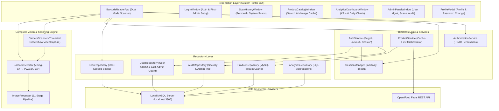
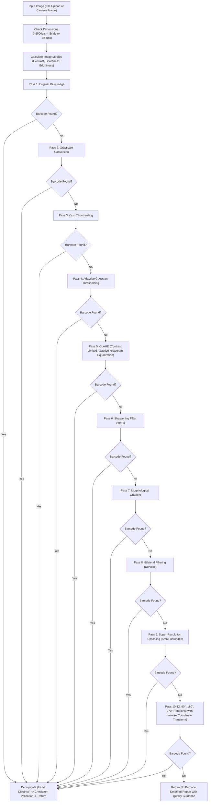
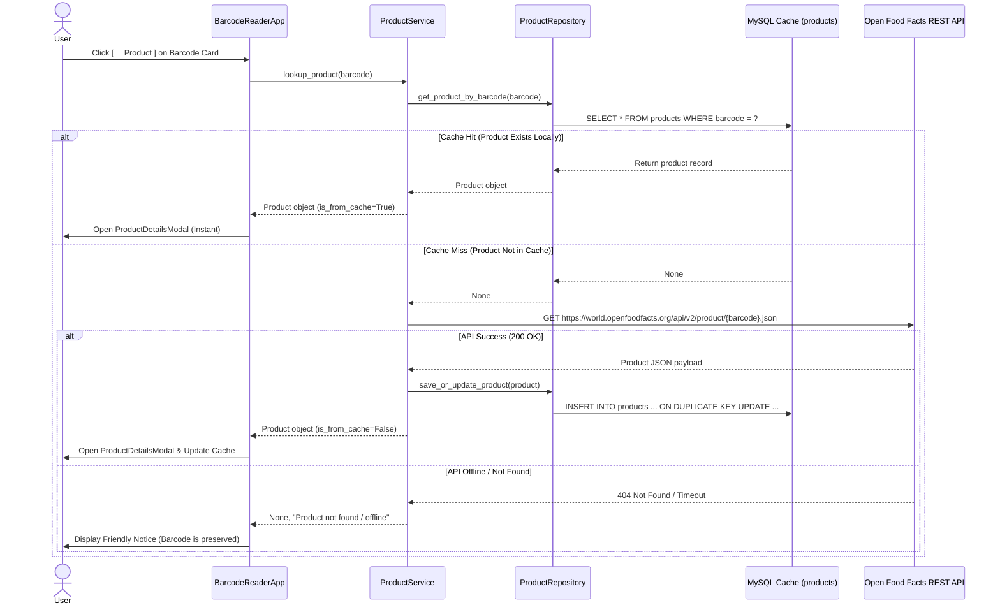

# Barcode Reader — System Architecture Document (v1.0.0)

This document provides a comprehensive technical overview of the **Barcode Reader** system architecture, design patterns, computer vision pipelines, database models, and security boundaries.

---

## 1. High-Level Architecture Overview

The system is designed following **Clean Layered Architecture** with distinct separation of concerns between the Presentation, Service, Repository, Computer Vision Engine, and Persistence layers.

---

## 2. Computer Vision & Barcode Decoding Pipeline

The image scanning engine incorporates an **11-stage fallback pipeline** with automatic quality metrics evaluation and rotation compensation:

---

## 3. Real-Time Camera Scanning & Stability Model

The live webcam scanning component operates on a dedicated capture thread using OpenCV's DirectShow backend:

* **Threaded Frame Acquisition**: `cv2.VideoCapture` runs asynchronously at 30 FPS.
* **Reticle Guide Overlay**: Visual HUD guide marking the optimal scanning area.
* **Fast-Mode Decoding**: Lightweight single-pass decoding on live frames minimizing latency.
* **Consecutive-Frame Stability ($N=3$)**: Requires 3 continuous detections of identical payload before emitting a confirmed scan event.
* **Duplicate Cooldown ($2.0\text{s}$)**: Prevents duplicate save events when holding a barcode in front of the camera.
* **Auto-Release Safety**: Automatically releases the webcam on mode switch, user logout, inactivity timeout, or window close (`WM_DELETE_WINDOW`).

---

## 4. Product Intelligence & Cache-First Architecture

---

## 5. Security & Authentication Architecture

1. **Password Security**:
   * Stored exclusively as bcrypt one-way hashes (`bcrypt.hashpw(password, bcrypt.gensalt(12))`).
   * Passwords are never stored in plaintext, sessions, or logs.
2. **Brute-Force Protection**:
   * Per-identifier failed attempt tracking with temporary lockout after 5 consecutive failed attempts (`MAX_LOGIN_ATTEMPTS=5`, `LOGIN_LOCKOUT_MINUTES=5`).
3. **Session Inactivity Management**:
   * In-memory session tracking `login_time` and `last_activity_time`.
   * Automatic session expiration after 30 minutes of inactivity (`SESSION_TIMEOUT_MINUTES=30`).
4. **Data Isolation & Parameterized SQL**:
   * Every SQL query is parameterized against SQL injection attacks.
   * Normal user scan queries strictly enforce `WHERE user_id = current_user.id`.
   * Normal user deletion queries strictly enforce `DELETE FROM barcode_scans WHERE id = %s AND user_id = %s`.
5. **Last-Admin Protection**:
   * System prohibits deactivating or demoting the final active administrator account.
